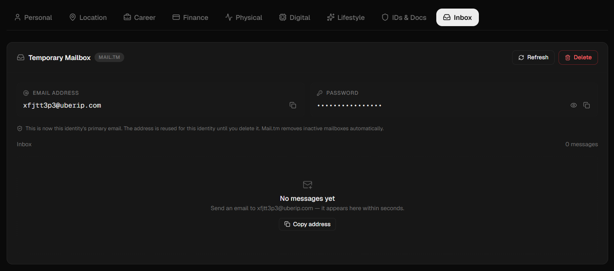
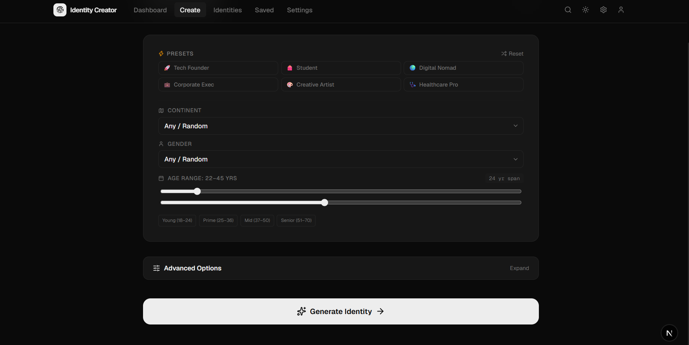
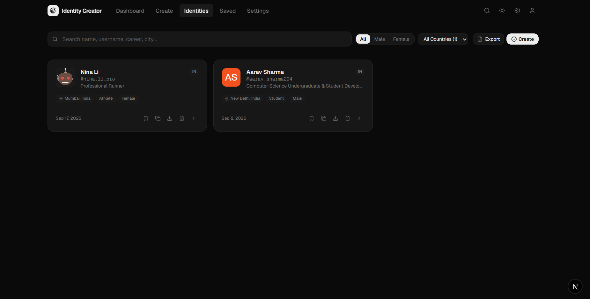
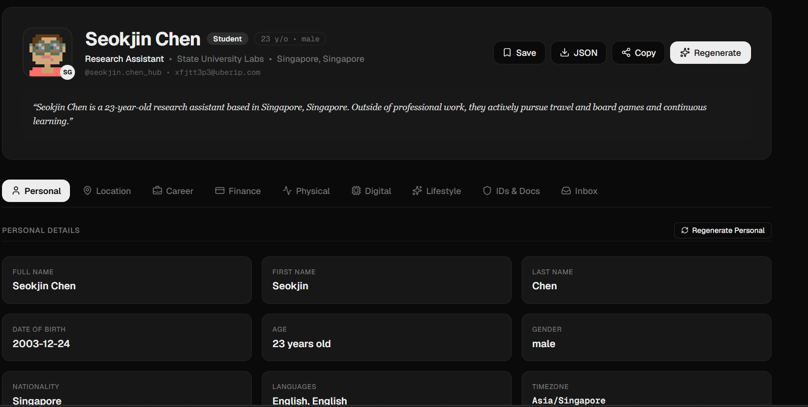
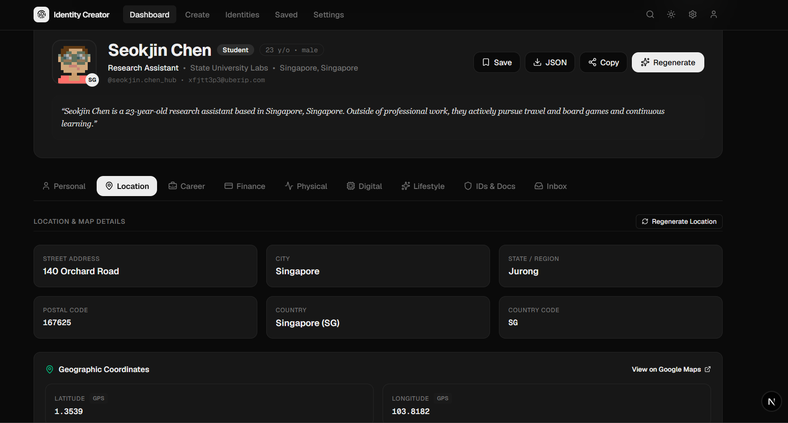

<div align="center">

# Identity Creator

**Open-source synthetic identity generator for testing, prototyping, and development.**

[](LICENSE)
[](https://nextjs.org/)
[](https://react.dev/)
[](https://www.typescriptlang.org/)

Generate realistic, fully-formed fictional identities complete with names, addresses, careers, financial details, platform usernames, temporary email, and more — all running locally in your browser with zero data collection.

[Getting Started](#getting-started) | [Features](#features) | [Screenshots](#screenshots) | [Contributing](#contributing) | [Privacy](PRIVACY.md)

</div>

---

## Why Identity Creator?

When building apps, you often need realistic test data. Identity Creator generates **complete synthetic profiles** — not just a name and email, but full life details including career history, financial data, physical attributes, lifestyle info, and document placeholders.

**Works 100% offline.** No API key required. Optionally connect to Google Gemini for AI-enhanced biographies and richer profiles.

---

## Screenshots

### Create Page — Quick Presets & Controls


### Identities — Browse & Manage Generated Profiles


### Identity Detail — Personal Information


### Identity Detail — Location & Map Data


### Temporary Inbox — Disposable Email via Mail.tm


---

## Features

### Core Generation
- **Offline-first** — Works without any API key using bundled data
- **AI-enhanced** — Optional Gemini integration for richer bios and profiles
- **Batch generation** — Create 5, 10, 25, or 50 identities at once
- **Quick presets** — Tech Founder, Student, Digital Nomad, Corporate Exec, Creative Artist, Healthcare Pro
- **Granular controls** — Filter by continent, gender, age range

### Profile Sections
- **Personal** — Full name, DOB, age, gender, nationality, languages, timezone
- **Location** — Street address, city, state, country, postal code, GPS coordinates
- **Career** — Job title, company, industry, education, experience
- **Finance** — Income range, bank details, credit score
- **Physical** — Height, weight, blood type, hair/eye color
- **Digital** — Platform usernames, social links, device info
- **Lifestyle** — Interests, hobbies, habits
- **IDs & Docs** — Placeholder document numbers

### Utilities
- **Temporary email** — Disposable inbox via [Mail.tm](https://mail.tm) integration
- **Platform usernames** — Auto-generated for 10+ platforms (GitHub, Twitter, Instagram, etc.)
- **Export** — JSON, CSV, TXT, PDF formats
- **Copy to clipboard** — One-click copy of any section
- **Search & filter** — Find identities by name, username, career, or city
- **Dark/Light theme** — Toggle between modes
- **Local storage** — Profiles persist across sessions

---

## Tech Stack

| Layer | Technology |
|-------|------------|
| Framework | [Next.js 16](https://nextjs.org/) (App Router) |
| UI | [React 19](https://react.dev/) + [Tailwind CSS 4](https://tailwindcss.com/) |
| Language | [TypeScript 5](https://www.typescriptlang.org/) |
| Animation | [Framer Motion](https://www.framer.com/motion/) |
| Icons | [Lucide React](https://lucide.dev/) |
| Avatars | [DiceBear](https://www.dicebear.com/) (public API) |
| Temp Email | [Mail.tm](https://mail.tm/) (public API) |

---

## Getting Started

### Prerequisites

- [Node.js](https://nodejs.org/) 18 or later
- [npm](https://www.npmjs.com/), [yarn](https://yarnpkg.com/), or [pnpm](https://pnpm.io/)

### Installation

```bash
# Clone the repository
git clone https://github.com/11nawid/identity-creator.git
cd identity-creator

# Install dependencies
npm install

# Copy the example config
cp config.example.json config.json

# Start the dev server
npm run dev
```

Open [http://localhost:3000](http://localhost:3000) in your browser.

### Build for Production

```bash
npm run build
npm start
```

---

## Configuration

### Environment Variables

Create a `.env.local` file (or copy `.env.example`):

```env
# Optional: AI enhancement via Google Gemini
# Get a free key at https://aistudio.google.com/app/apikey
GEMINI_API_KEY=
GEMINI_MODEL=gemini-3.7-flash
```

**The app works perfectly without any API key.** The offline generator uses bundled name banks, professions, and public APIs for avatars and geocoding.

### Config File

Copy `config.example.json` to `config.json` and customize:

```json
{
  "api_key": null,
  "api_model": "gemini-3.7-flash",
  "retry_attempts": 3,
  "retry_delay_sec": 2,
  "request_timeout_sec": 60
}
```

---

## Project Structure

```
identity-creator/
├── src/
│   ├── app/              # Next.js App Router pages & API routes
│   │   ├── api/          # Backend API endpoints
│   │   ├── create/       # Identity creation page
│   │   ├── identity/     # Identity detail view
│   │   ├── identities/   # Browse all identities
│   │   ├── saved/        # Saved profiles
│   │   └── settings/     # App settings
│   ├── components/       # React UI components (22+)
│   ├── data/             # Country data, name banks, offline data
│   ├── lib/              # Utilities, generators, exporters
│   └── types/            # TypeScript interfaces
├── docs/screenshots/     # README screenshots
├── scripts/              # Dev scripts
├── config.example.json   # Example configuration
└── .env.example          # Example environment variables
```

---

## Contributing

Contributions are welcome! Please see [CONTRIBUTING.md](CONTRIBUTING.md) for guidelines.

1. Fork the repository
2. Create a feature branch (`git checkout -b feature/amazing-feature`)
3. Commit your changes (`git commit -m 'Add amazing feature'`)
4. Push to the branch (`git push origin feature/amazing-feature`)
5. Open a Pull Request

---

## Security

To report security vulnerabilities, please see [SECURITY.md](SECURITY.md).

---

## Privacy

This project is built with privacy as a core principle. See [PRIVACY.md](PRIVACY.md) for full details.

**In short:** Everything runs locally. No data is collected, tracked, or sent anywhere unless you explicitly provide an API key.

---

## License

This project is licensed under the MIT License — see the [LICENSE](LICENSE) file for details.

---

<div align="center">

**Built with care for the developer community.**

If you find Identity Creator useful, consider giving it a star on [GitHub](https://github.com/11nawid/identity-creator).

</div>
